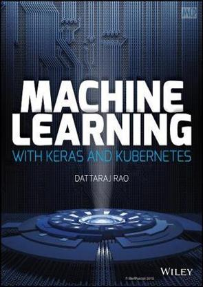

# ML-Intro
This Github repo serves as an introduction to Machine Learning where I cover the basics of supervised and unsupervised learning  and the different algorithms that exist using Python and scikit-learn library.

## Book recommendation

  
    
  I highly recommend the book **Keras to Kubernetes: The Journey of a Machine Learning Model to Production**.

